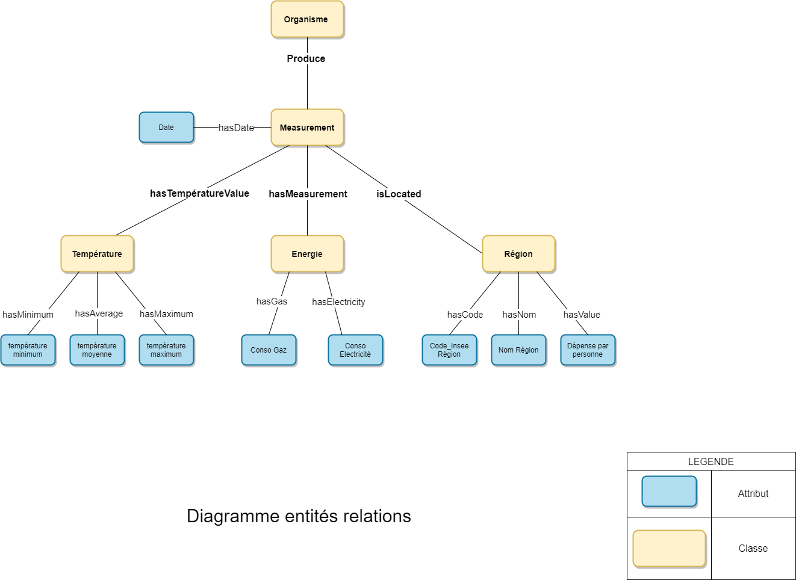

# ProjetOpenData
<h1> Projet de M2 MIASHS sur la création d'un serveur web utilisant de l'OpenData </h1>  
Membres du groupe : Alaka Moulikatou, Cassan Mélodie, Moreno Jonathan, Salah Salah Karim , Theron Emmanuelle, klein Alexandre   
<h2>Intitulé du projet : Evolution de la consommation électrique en fonction de la température </h2>
L'objectif de ce projet est de mieux comprendre comment les variations de températures impacte la consommation globale d'energie (éléctricité et/ou gaz)  
Pour cela, le but est de  pouvoir récupérer au format souhaité un fichier (JSON, XML ou RDF/XML) qui regroupe les informations concernant deux sources de données.  
Nous avons choisi de lier deux sources de données ayant en commun leur identifiant de région pour pouvoir récupérer les informations de consommations électrique, de température et de budget pour chaque habitant spécifiques à une ou plusieurs régions et à une période donnée. 
<h2> Données utilisées : </h2>
  <li> Données énergétiques :  
  Ce jeu de données présente les courbes de consommation régionale d’électricité (par demi-heure en MW) et de gaz (par heure en MW PCS 0°C).
Périmètre électricité : France métropolitaine hors Corse. Les années 2013 à 2019 sont au statut définitif. Les données 2020 et 2021 sont au statut intermédiaire.
  Ces données sont sous la Licence Ouverte v2.0 (Etalab).
  Ces données sont produites par GRTgaz, RTE et Teréga. Elles sont hébérgées par Open Data Reseaux Energie 
 Les données sont accessibles via ce lien :  
  <href> https://opendata.reseaux-energies.fr/explore/dataset/consommation-quotidienne-brute-regionale/table/?disjunctive.code_insee_region&disjunctive.region&sort=date </href>

</li>
  <li> Données météorologiques :  
  Ce jeu de données présente les températures minimales, maximales et moyennes quotidiennes (en degré celsius), par région administrative française, du 1er janvier 2016 à aujourd'hui. Il est basé sur les mesures officielles du réseau de stations météorologiques françaises. La mise à jour de ce jeu de données est mensuelle. 
  Ces données sont sous la Licence Ouverte v2.0 (Etalab).
  Ces données sont produites par Weathernews France. Elles sont hébérgées par Open Data Reseaux Energie Les données sont accessibles via ce lien :  
  <href>https://opendata.reseaux-energies.fr/explore/dataset/temperature-quotidienne-regionale/information/?disjunctive.region&sort=-date</href>  

</li>
<li> Données de budget par habitants par région :  
  Les comptes des régions 2012-2020 présentent les principaux agrégats des comptes des régions pour la période 2012-2020. Le calcul des agrégats a été réalisé par l'OFGL à partir des données des balances comptables des régions publiées par la DGFiP.  Les données sont disponibles via ce lien : 
  <href>https://www.data.gouv.fr/fr/datasets/comptes-des-regions-2012-2020/</href>
  <h2> Stratégie de croisement des deux sources de données : </h2>
  Les deux sources de données présentent des informations sur les régions françaises administratives et contiennent  au moins une mesure par jour. Nous avons donc, choisi de croiser ces données selon le code insee de la région et en fonction de la date.  
  

URL d'accès à l'API :  
 <h2> Description de l'API : </h2>
  <li> L'adresse du serveur déployé est disponible à cette adresse : <href> https://projectopendata.herokuapp.com/ </href>
  
   
   
     <li>L'URL de la requête est la suivante : /regions/:regionId, où :regionId doit être remplacé soit par le code INSEE de la région voulue, soit son nom complet (sans espaces, tirets ou accents) en minuscule. Il est également possible de préciser une période, avec le paramètre date qui pourra concerncer une année (date=YYYY), un mois (date=YYYY-MM), ou un jour spécifique (date=YYYY-MM-DD), où YYYY représente l'année sur 4 caractères, MM le mois sur 2 caractères et DD le jour sur 2 caractères. 
  En cas de mauvais identifiant ou nom de région renseigné, une erreur 400 sera renvoyée de la forme suivante : "Le code région doit être un code INSEE de région de France métropolitaine (hors Corse) valide. Le nom de la région est également accepté, sans espace ni tirets."</li>  

  <h3> Exemples de requête : </h3>
  
</li>

<li> Exemple 1: Les données de consommation électrique et de température dans la région Occitanie pour l'ensemble de l'année 2018 :  
https://projectopendata.herokuapp.com/regions/occitanie/?date=2018
</li>
    
 <li> Exemple 2: Les données de consommation électrique et de température dans la région nouvelle Aquitaine le 31 décembre 2017 :  
 https://projectopendata.herokuapp.com/regions/75/?date=2017-12-31
 </li>
    
  <li> Exemple 3: Les données de consommation électrique et de température dans la région Auvergne-Rhône-Alpes pour les derniers résultats (jusqu'à une limite de 10000 résultats) :  
  https://projectopendata.herokuapp.com/regions/84
  </li>

    
 <h3> Informations dans le header </h3>
 
   
 <li>Les langues demandées doivent être précisées dans le header avec la clé "Accept-Language". (Seul le fr est supporté, l'erreur 400 suivante sera renvoyée si une autre langue est demandée : "La seule langue supportée par l'API est le français. Merci de modifier le header "Accept-Language" par "fr", ou de le supprimer." </li>
 
   
     <li>Le format de sorti accepté doit également être précisé dans le header avec la clé "Accept". Les valeurs de format supportées sont : "application/json", "application/xml", "application/rdf+xml". Par défaut, un format json sera renvoyé. Si le format n'est pas supporté, l'erreur 400 "Mauvais format demandé dans le header "Accept". Les formats acceptés sont: application/json (valeur par défaut), application/xml, application/rdf+xml" sera renvoyée.
   <h3> Structure du RDF/XML proposé en sortie de l'API : </h3>
  
  
  
  Il est possible de demander l'export des données au format RDF/XML. La construction de celui ci répond au schéma relationnel ci dessus. Les vocabulaires utilisés sont des vocabulaires validés par la commmunauté et disponible à cette adresse : <href>https://lov.linkeddata.es/dataset/lov/</href>  
  L'export RDF/XML de notre API a été validé avec l'outil RDF Validator du W3C <href>https://www.w3.org/RDF/Validator/</href>  
  
  <h2> Technologie et packages utilisés : </h2>
  <li> Le serveur a été codé en utilisant JavaScript. Il est hébergé sur Heroku. </li>
  <li> Nous avons utilisé les packages : node-js, express, fetch, js2xmlparser, promise. La version exacte des packages utilisés est spécifiée dans packge.json

    
  
  
  
 
  
  
  
